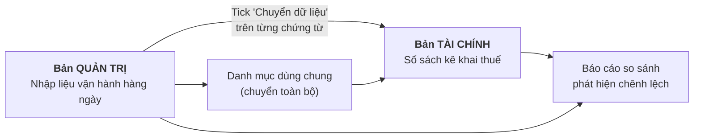

# Về doanh nghiệp và phạm vi hệ thống

## Công ty TNHH MTV Phổ Đình

- Thành lập từ **năm 2009**, là chuỗi nhà hàng thuộc **URAETEI GROUP**, kinh doanh chủ yếu về **ẩm thực Nhật Bản**.
- Ngoài thương hiệu Phổ Đình còn có thương hiệu **Sushi** (2 chi nhánh) trong phạm vi xử lý hóa đơn.

## Cơ cấu đơn vị cơ sở

| Đơn vị | Ghi chú |
|---|---|
| Văn phòng HCM | Đơn vị quản lý |
| Xưởng sản xuất KCN Hiệp Phước | Nơi sản xuất bán thành phẩm/thành phẩm, tính giá thành xưởng |
| 10 chi nhánh nhà hàng | Các nhà hàng thuộc hệ thống Phổ Đình, tính giá thành chi nhánh |

!!! note "Về số lượng chi nhánh"
    Tài liệu BRD ghi **10 chi nhánh**. Tài liệu yêu cầu phần mềm hóa đơn ghi **~13 chi nhánh Phổ Đình + 2 chi nhánh Sushi** — con số này bao gồm cả các MST con phục vụ kê khai thuế. Khi tra cứu cần phân biệt "chi nhánh vận hành" và "MST kê khai".

## Quy mô hệ thống Arito

- **01 bản cài đặt** hệ thống Arito (ARITO).
- **30 user** đăng nhập đồng thời.

## Hai môi trường: Quản trị và Tài chính

Đây là đặc điểm quan trọng nhất chi phối gần như toàn bộ thiết kế hệ thống:

**Nguyên tắc:** bộ mã danh mục ở hai bản **phải đồng nhất**. Nếu mã Quản trị và Tài chính khác nhau thì phải chạy chuyển mã từ Quản trị để đồng bộ lại sang Tài chính (gộp mã hoặc đổi mã).

Chi tiết chứng từ nào được chuyển: xem [Chuyển dữ liệu Quản trị → Tài chính](../03-tckt/chuyen-du-lieu.md).

## Nguồn tài liệu

| Tài liệu | Mã / Ngày |
|---|---|
| BRD Tài chính Kế toán | 260727-TLKS/PHODINH-TCKT · lập 27/07/2026 |
| BRD Mua hàng | 260727-TLKS/PHODINH-TCKT · lập 27/07/2026 |
| Bộ câu hỏi khảo sát | ARITO_Bo cau hoi khao sat_PHODINH.xlsx |
| Meeting recap | 02/07/2026 và 15/07/2026 |
| Bảng tổng hợp yêu cầu hóa đơn | tổng hợp 02/07/2026 |
