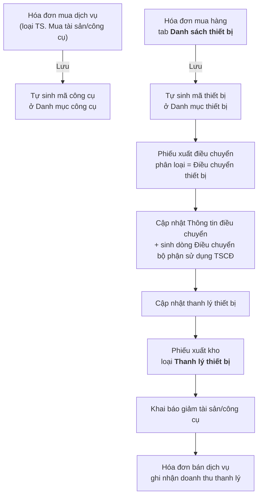

# Danh mục & quy trình Tài sản / Công cụ / Thiết bị

## Nguyên tắc thiết lập

Quản lý tài sản của doanh nghiệp và theo dõi phân bổ chi phí khấu hao. Thông tin quản lý gồm: **ngày tăng, ngày tính khấu hao, số kỳ khấu hao, ngày kết thúc khấu hao, nguyên giá, giá trị khấu hao một kỳ**.

## Yêu cầu chung

- Chi phí **khấu hao/phân bổ tính theo ngày** (tham số hệ thống Arito cho phép chọn theo ngày hoặc tròn tháng).
- **Bán thanh lý** dùng hóa đơn bán hàng → kế toán khai báo giảm tài sản để xử lý chi phí còn lại.
- Các khoản **chi phí trả trước** làm bên **bản Tài chính** và phân bổ tại đó.
- Các mã **đầu kỳ không khớp** giữa Quản trị và Tài chính — sau này sẽ quy định lại và khớp mã giữa hai môi trường.
- Tài sản và công cụ **sẽ nhập kho**.
- Điều chuyển dùng **Phiếu xuất điều chuyển** → sinh tài sản.

!!! question "Điểm cần làm rõ"
    Luồng điều chuyển thiết bị nội bộ → **mã của đơn vị mới** sẽ xử lý thế nào? Ghi nhận trong họp 15/07/2026, chưa chốt.

## Luồng nghiệp vụ đầy đủ

## Chi tiết từng bước

### 1. Hóa đơn mua dịch vụ — chi phí trả trước

Khi phát sinh chi phí trả trước, kế toán dùng **hóa đơn mua dịch vụ** để ghi nhận và tạo một **mã công cụ** ở danh mục công cụ để theo dõi phân bổ hàng kỳ.

Khi lưu hóa đơn loại **TS. Mua tài sản/công cụ**, chương trình **tự sinh mã công cụ** tại màn hình Danh mục công cụ.

### 2. Hóa đơn mua hàng — tab Danh sách thiết bị

Màn hình hóa đơn mua hàng thêm tab **Danh sách thiết bị**. Khi lưu, chương trình tự sinh một mã thiết bị sang danh mục thiết bị:

| Trường | Quy tắc |
|---|---|
| Đơn vị | Gán theo **đơn vị nhập kho** |
| Mã thiết bị | Người dùng nhập |
| Tên thiết bị | Người dùng nhập |
| Nguyên giá | Người dùng nhập giá trị |
| Loại tài sản/công cụ | Chọn từ danh mục — quyết định thiết bị này là **tài sản** hay **công cụ** |

!!! note
    Các mã tài sản/công cụ **đầu kỳ** của kế toán và bộ phận thiết bị theo dõi **độc lập**; các phát sinh **sau đó** sẽ khớp giữa kế toán và bộ phận thiết bị.

### 3. Phiếu xuất điều chuyển

- Thông tin chung thêm **phân loại**: `Điều chuyển vật tư` / `Điều chuyển thiết bị`.
- Khi chọn `Điều chuyển thiết bị`, hiện tab **Thiết bị điều chuyển**: Mã thiết bị (chọn từ danh mục), Ngày điều chuyển, Đơn vị nhận, Ghi chú.
- Khi lưu: tự thêm vào chi tiết **Thông tin điều chuyển** ở Danh mục thiết bị **và** tự sinh một dòng điều chuyển tài sản ở **Điều chuyển bộ phận sử dụng TSCĐ/công cụ**.

### 4. Phiếu xuất kho — thanh lý

- Thông tin chung giao dịch thêm loại **Thanh lý thiết bị**.
- Hiện tab **Thiết bị thanh lý**: Mã thiết bị, Ngày thanh lý (mặc định theo ngày hóa đơn bán hàng), Lý do thanh lý (chọn từ danh mục lý do).
- Dùng để **truy vết** phiếu xuất kho thuộc thiết bị thanh lý nào.

### 5. Khai báo giảm tài sản/công cụ

Sau khi bộ phận thiết bị hoàn tất thủ tục thanh lý, kế toán khai báo giảm:

| Loại | Xử lý |
|---|---|
| **Tài sản** | Chương trình **tự sinh** bút toán: `Nợ 214 / Có 211` và `Nợ 811 / Có 211` (nếu còn giá trị khấu hao) |
| **Công cụ** | Kế toán tạo **phiếu kế toán** để giảm 242 tương ứng |

### 6. Hóa đơn bán dịch vụ — ghi nhận doanh thu thanh lý

`Nợ 131 / Có 711` và `Nợ 131 / Có 333`
