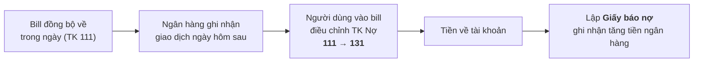

# Bán hàng

## Yêu cầu chung

### Nguồn hóa đơn bán hàng

- Hóa đơn **bán món ăn** được **đồng bộ từ POS**.
- Các nghiệp vụ bán khác kế toán **tự nhập lên**.
- Hình thức thanh toán là **voucher** sẽ có một tài khoản tương ứng khi đồng bộ POS → **Phổ Đình gửi danh sách để thiết lập**.
- Thêm trường **ngày hóa đơn gốc** và lấy lên bảng kê để xác định ngày kê khai gốc.

### Thu tiền theo thực tế

> Khi thu tiền bill bán hàng, Phổ Đình cần ghi nhận **số tiền thu được đúng thực tế**, để làm tròn số tiền thực tế thu được.

## Giải pháp thực hiện

### Mapping phương thức thanh toán

Sử dụng chuẩn hiện có: dựa vào các hình thức **voucher** để **sinh tự động phiếu kế toán**. Khi tạo chứng từ thu tiền, các hình thức là voucher sẽ được tạo phiếu kế toán tương ứng.

### Trường "Ngày hóa đơn gốc"

Hóa đơn bán hàng thêm trường ở Thông tin chung:

| Trường | Quy tắc |
|---|---|
| **Ngày hóa đơn gốc** | Chọn ngày, **mặc định theo ngày chứng từ**. Kế toán chọn lại ngày kê khai khi hóa đơn là **điều chỉnh** hoặc **thay thế** |

### Thu tiền POS

Phổ Đình nhập **số tiền thực tế thu được**; Arito tạo **phiếu thu dựa trên số thực thu** ở các cửa hàng.

## Xử lý tiền về ngày hôm sau

Đây là tình huống vận hành thường gặp nhất:

Chi tiết xem [Phân hệ Quỹ](quy-ngan-hang.md).

## Bán hàng nội bộ giữa chi nhánh (đi tỉnh)

Ghi nhận trong họp 15/07/2026 — luồng hạch toán khi chi nhánh đi tỉnh xuất hóa đơn VAT:

| Bên | Bút toán |
|---|---|
| Giá vốn (đích danh) | `Nợ 632 / Có 15x` |
| Doanh thu (đích danh) | `Nợ 136 / Có 511NB` |
| Chi nhánh hạch toán | `Nợ 15x / Có 336` |

!!! warning "Chưa chốt"
    - **Phổ Đình** xem lại hạch toán 336/136.
    - **Arito** check lại luồng xuất hóa đơn về tỉnh giữa các chi nhánh.
