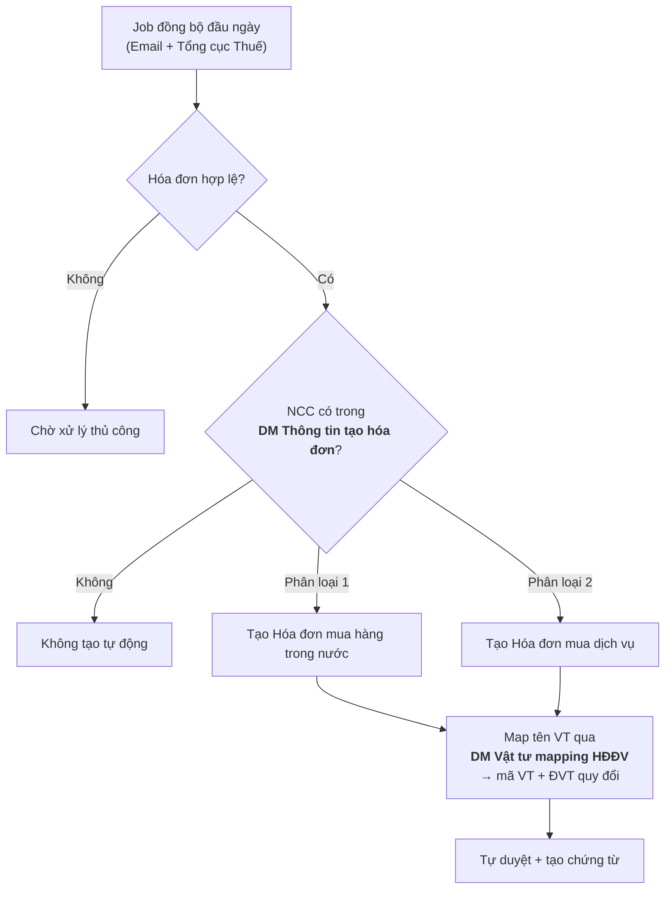

# Mua hàng (góc nhìn kế toán) & Hạch toán tự động hóa đơn

## Yêu cầu chung

- Hóa đơn mua hàng trong nước và mua dịch vụ **không** chuyển từ Quản trị sang Tài chính; nghiệp vụ **mua tài sản/công cụ nhập kho thì chuyển**, thêm trường **ngày hóa đơn gốc** để xác định kỳ kê khai gốc.
- Bản Tài chính khi đồng bộ hóa đơn từ thuế/email: hóa đơn **hợp lệ** thì **tự duyệt và tạo tự động chứng từ**.
- Hóa đơn nhập khẩu **được chuyển**; chi phí kèm theo **không hợp lệ thì không chuyển**.

Xem đầy đủ tại [Chuyển dữ liệu](chuyen-du-lieu.md).

---

## Hai danh mục nền tảng cho hạch toán tự động

### Danh mục vật tư mapping HĐĐV

**Vấn đề:** mỗi nhà cung cấp đặt một tên khác nhau cho cùng một mặt hàng trên hóa đơn.

**Giải pháp:** thêm mới danh mục **Vật tư mapping HĐĐV**, map tên vật tư NCC ghi trên hóa đơn về mã vật tư nội bộ.

| Trường | Mô tả |
|---|---|
| **Tên vật tư** | Nhập tên vật tư nhà cung cấp xuất hóa đơn |
| **Tên đvt** | Tên đơn vị tính mà nhà cung cấp xuất |
| **Phân loại** | `1. Hàng hóa` / `2. Dịch vụ` |
| **Mã VT thay thế** | Ẩn/hiện khi phân loại = 1 (hàng hóa) — chọn từ danh mục vật tư |
| **Mã dịch vụ thay thế** | Ẩn/hiện khi phân loại = 2 (dịch vụ) — chọn từ danh mục dịch vụ |

Từ mapping này hệ thống xác định được **mã vật tư** và **đơn vị tính quy đổi**.

### Danh mục Thông tin tạo hóa đơn

Xác định hóa đơn sẽ tạo ra **hóa đơn mua hàng** hay **hóa đơn mua dịch vụ**.

| Trường | Mô tả |
|---|---|
| **Mã nhà cung cấp** | Chọn từ danh mục nhà cung cấp |
| **Tên nhà cung cấp** | Tự hiện theo mã NCC |
| **Phân loại** | `1. Mua hàng hóa` → tạo **hóa đơn mua hàng trong nước** `2. Mua dịch vụ` → tạo **hóa đơn mua dịch vụ** |

!!! warning "Điều kiện bắt buộc"
    Chương trình **chỉ tạo hóa đơn mua vào dựa trên danh sách này**. Nếu NCC chưa được khai báo ở đây thì **chương trình sẽ không tạo tự động**.

---

## Tạo tự động hóa đơn

Hóa đơn đầu vào được **đồng bộ tự động vào đầu ngày**, từ **email** và từ **Tổng cục Thuế**.

Chi tiết yêu cầu nghiệp vụ về thu thập hóa đơn: xem chuyên mục [Hóa đơn điện tử đầu vào](../05-hoa-don-dau-vao/tong-quan.md).

---

## Yêu cầu tách Khuyến mãi và Chiết khấu

Khi hạch toán, **tách KM và CK thành cột riêng** — thêm cột **KM**, **CK** trên hóa đơn mua trong nước và hóa đơn mua dịch vụ.
