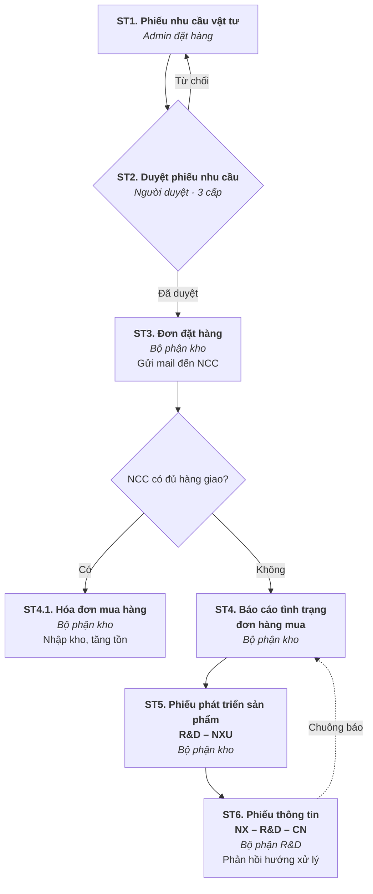

# Quy trình mua hàng

Nguồn: BRD Mua hàng — *ARITO x PHODINH - Tài liệu khảo sát Mua hàng*, mã 260727-TLKS/PHODINH-TCKT.

## Sơ đồ quy trình

## Mô tả từng bước

### ST1 — Phiếu nhu cầu vật tư · *Admin đặt hàng*

| | |
|---|---|
| **Đầu vào** | Danh sách vật tư, hàng hóa cần mua để thực hiện món ăn |
| **Thực hiện** | Tạo lập phiếu nhu cầu vật tư: • Vật tư **đã có** trong danh mục → chọn mã tương ứng • Vật tư **chưa có mã** → chọn **mã vật tư chung**, ghi chú lại tên vật tư thực tế cần mua, **đính kèm hình ảnh thực tế** trên phiếu |
| **Đầu ra** | Phiếu nhu cầu vật tư được tạo trên phần mềm |

### ST2 — Duyệt phiếu nhu cầu · *Người duyệt*

| | |
|---|---|
| **Đầu vào** | Phiếu nhu cầu vật tư đã tạo |
| **Thực hiện** | Dựa vào tình trạng hàng cần mua, phiếu được gửi đến người phụ trách tương ứng để phê duyệt qua **3 cấp duyệt**. • **Đã duyệt** → gửi thông báo đến người yêu cầu, chuyển sang **ST3** • **Từ chối** → gửi thông báo, người yêu cầu tạo yêu cầu mới, quay lại **ST1** |
| **Đầu ra** | Phiếu nhu cầu vật tư được phê duyệt |

!!! warning "Chưa hoàn tất"
    Bảng cấp duyệt (Cấp 1 / Cấp 2 / Cấp 3 — nguyên tắc duyệt và người duyệt) trong BRD **vẫn để trống**. **Phổ Đình cung cấp sau** người duyệt tương ứng của mỗi cấp.

Chi tiết thao tác duyệt: xem [Duyệt yêu cầu qua email & trên chương trình](duyet-yeu-cau.md).

### ST3 — Đơn đặt hàng · *Bộ phận kho*

| | |
|---|---|
| **Đầu vào** | Phiếu nhu cầu vật tư được phê duyệt |
| **Thực hiện** | Kế thừa các phiếu yêu cầu đã duyệt để tạo **một đơn hàng mua**; đơn hàng mua được **gửi mail đến nhà cung cấp** để đặt hàng |
| **Đầu ra** | Đơn hàng mua được tạo lập trên phần mềm |

### ST4 — Báo cáo tình trạng đơn hàng mua · *Bộ phận kho*

| | |
|---|---|
| **Đầu vào** | Đơn hàng mua đã tạo và **NCC không đủ hàng giao** |
| **Thực hiện** | Kho nhập thông tin **thiếu hàng / không còn hàng** khi NCC phản hồi. → Kho gửi thông tin đến bộ phận R&D bằng **Phiếu phát triển sản phẩm R&D**; chương trình mặc định các thông tin có sẵn, thông tin khác kho điền form |
| **Đầu ra** | Đơn hàng được kiểm tra và báo cáo tình trạng cho bộ phận R&D |

### ST4.1 — Hóa đơn mua hàng · *Bộ phận kho*

| | |
|---|---|
| **Đầu vào** | Đơn hàng mua đã tạo và **NCC giao hàng** |
| **Thực hiện** | Kế thừa đơn hàng sang **hóa đơn mua hàng** để nhập kho vật tư/hàng hóa và theo dõi tình trạng giao |
| **Đầu ra** | Hóa đơn mua hàng được tạo lập và **tăng tồn kho** |

### ST5 — Phát triển sản phẩm (R&D – NXU) · *Bộ phận kho*

| | |
|---|---|
| **Đầu vào** | Đơn hàng mua đã tạo và NCC không đủ hàng giao |
| **Thực hiện** | Kho điền thông tin phiếu phát triển sản phẩm; phiếu được gửi đến bộ phận R&D |
| **Đầu ra** | Phiếu phát triển sản phẩm được tạo lập trên hệ thống |

### ST6 — Phiếu thông tin (NX – R&D – CN) · *Bộ phận R&D*

| | |
|---|---|
| **Đầu vào** | Phiếu phát triển sản phẩm (R&D – NXU) |
| **Thực hiện** | R&D xử lý vấn đề giao hàng và **phản hồi lại thông tin cho bộ phận kho** thông qua phiếu thông tin (NX–R&D–CN) |
| **Đầu ra** | Phiếu thông tin được tạo lập |

## Hóa đơn mua hàng trong nước

- Sử dụng theo **chuẩn hiện tại** của quy trình mua hàng nhập kho.
- NCC có hàng và giao hàng → bộ phận kho dùng **phiếu giao hàng** để ghi nhận **tăng tồn kho**, theo dõi quá trình nhập/xuất và **điều chuyển đến các nhà hàng** đang cần hàng để sản xuất.
