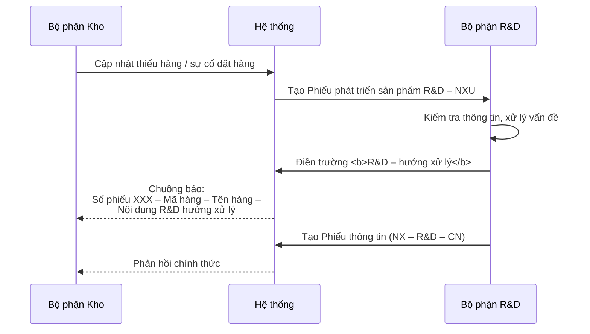

# Phiếu phát triển sản phẩm R&D – NXU

Đường dẫn hệ thống: **Kho / Phối Nội Vụ (R&D – NXU)** — mã màn hình `zcdmttltsp`

## Yêu cầu chung

- Tại phiếu R&D **cho phép tham chiếu vật tư thay thế**. Vật tư thay thế có thể khai trong danh mục vật tư nếu đã có mã cụ thể.
- **Tham chiếu từ phiếu R&D các mã chung** được đề xuất trước đó.

## Điều kiện trước: Danh mục vật tư

Cần khai báo tab **Vật tư thay thế** trong danh mục vật tư — xem [Danh mục vật tư, sản phẩm](../02-danh-muc/vat-tu-san-pham.md#tab-vat-tu-thay-the).

## Tab "Vật tư thay thế" trên phiếu

Lưu lại thông tin vật tư có thể thay thế cho mã hàng đang được nghiên cứu:

| Trường | Quy tắc |
|---|---|
| **Mã vật tư** | Chọn từ danh mục vật tư — **không bắt buộc** chọn |
| **Tên vật tư** | Mặc định hiện theo mã vật tư, **cho sửa lại tên** |
| **Đơn vị tính** | Mặc định hiện theo mã vật tư, **cho sửa lại** |

!!! tip "Vì sao không bắt buộc chọn mã"
    Vật tư thay thế có thể là mặt hàng chưa từng mua, chưa có mã trong danh mục. Cho phép nhập tên tự do để R&D ghi nhận trước, gán mã sau.

## Nút "Truy vấn vật tư thay thế"

Trả kết quả các vật tư có thể thay thế được khai báo tại:

1. Màn hình **Danh mục vật tư** (tab Vật tư thay thế), và
2. **Phiếu phát triển sản phẩm** liên quan đến mã hàng trước đó đã phát triển.

Thông tin trả về: `Mã vật tư` · `Tên vật tư` · `Đơn vị tính`.

## Luồng xử lý và phản hồi

**Nội dung chuông báo** gửi về nhóm user tạo phiếu nội vụ:

> `Số phiếu XXX – Mã hàng – Tên hàng – Nội dung trường "R&D – hướng xử lý"`

## Phiếu thông tin (NX – R&D – CN)

Sử dụng **phiếu thông tin hiện có**; chương trình **gán mặc định thông tin**, bộ phận R&D điều chỉnh và bổ sung thông tin để phản hồi xử lý lại cho bộ phận kho.

## Yêu cầu bổ sung từ họp 15/07/2026

> Khi **trả lại vật tư không mua được** sẽ **gợi ý các vật tư có thể thay thế**.

Đây là mở rộng của tính năng Truy vấn vật tư thay thế sang nghiệp vụ trả hàng.
