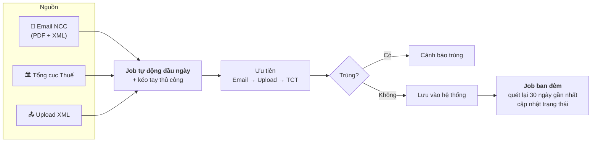

# Hóa đơn điện tử đầu vào — Tổng quan

## Mục tiêu

> Tự động **thu thập – kiểm tra – cảnh báo lỗi – lưu trữ – hạch toán** hóa đơn mua vào **đa chi nhánh** để kê khai thuế chính xác, kịp thời.

Phạm vi: chuỗi nhà hàng **Phổ Đình (~13 chi nhánh)** và **Sushi (2 chi nhánh)**.

## Ý chính — 4 nhóm

=== "Tài khoản & truy cập"

    - Dùng chung **1 link / 1 email** cho nhiều MST chi nhánh, kể cả các MST con của MST mẹ **0308455031**.
    - Phần mềm **tự tách theo MST**.
    - Tài khoản giữ **trong thời gian thuê** (không vĩnh viễn).

=== "Thu thập hóa đơn"

    - **3 nguồn**: Email NCC (PDF + XML) · Tổng cục Thuế · Tải lên XML.
    - Thứ tự ưu tiên: **Email → Upload → Tổng cục Thuế**.
    - **Cảnh báo trùng**.
    - Link cần **mã xác thực** → phải xử lý thủ công.

=== "Hiển thị & theo dõi"

    - Bổ sung cột: tên chi nhánh viết tắt, trạng thái/lỗi hóa đơn, **họ tên người mua**, **tệp đính kèm**.
    - Xem **song song 2 tab** (Hóa đơn NCC / Hóa đơn TCT).
    - Cảnh báo khi hóa đơn bị **hủy / thay thế / điều chỉnh / 04SS**.
    - Bộ lọc **hóa đơn rủi ro**.
    - Nút **kiểm tra lại trạng thái**.

=== "Kết xuất, in & lưu trữ"

    - In hàng loạt theo **chi nhánh / thời gian**.
    - Chọn khoảng thời gian và **tùy chỉnh cột** khi kết xuất.
    - Xuất Excel **BKMV** (theo TT80/2021) và **Bảng hạch toán** chi tiết.
    - **Số hóa đơn quy về 8 chữ số**.
    - Tải hàng loạt lưu theo folder `MST_Tên NCC`, chia theo tháng/năm.

## Cơ chế lấy hóa đơn

**Hai cơ chế kéo hóa đơn:**

1. **Job tự động** chạy vào **đầu ngày**
2. **Kéo tay thủ công** khi user chủ động

**Nút check lại hóa đơn:** chạy **tự động vào ban đêm**, quét lại hóa đơn trong **30 ngày gần nhất** và tự động cập nhật trạng thái. *(Đã có)*

## Chính sách sản phẩm

| Nội dung | Chính sách |
|---|---|
| Hình thức | Thuê **hằng năm** |
| Phí gia hạn | **1.000.000 đ/năm** — vẫn xem được dữ liệu |
| Lưu trữ dài hạn | Xuất **Excel / PDF** để lưu trữ |
| Cập nhật khi quy định thuế thay đổi | **Miễn phí** |
| Khi ngừng sử dụng | Dừng nhận email CC khi kết thúc |
| Không lấy đủ hóa đơn | Arito hỗ trợ đẩy vào và giải thích nguyên nhân, **không tính phí** |

## Kết luận đánh giá

> Phần lớn yêu cầu Arito **đáp ứng được** hoặc **"Chỉnh sửa được"**. Một số tình huống kỹ thuật (link cần mã xác thực, in nhanh từ phần mềm) **phải xử lý thủ công**.
>
> Trọng tâm hiện nay là **hoàn thiện chi tiết các cột dữ liệu** trong hai mẫu kết xuất (BKMV, HachToan) và bổ sung các **bộ lọc/tiện ích tra cứu**.

## Đọc tiếp

- [26 yêu cầu gốc + phản hồi Arito](yeu-cau-goc.md)
- [15 yêu cầu bổ sung 30/06/2026](yeu-cau-bo-sung.md)
- [Mẫu kết xuất BKMV & Hạch toán](bkmv-hach-toan.md)
- [Vấn đề còn tồn đọng](van-de-ton-dong.md)
