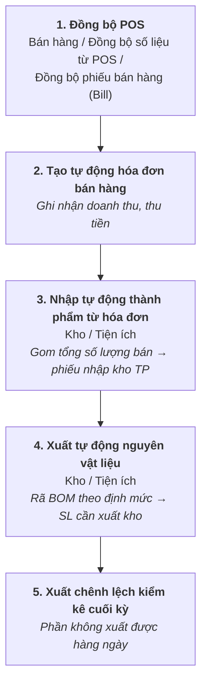

# Giá thành chi nhánh (nhà hàng)

## Luồng chi phí — khác hẳn giá thành xưởng

| Yếu tố chi phí | Xử lý ở chi nhánh |
|---|---|
| **621 — NVL** | Dữ liệu nào xuất kho hàng ngày theo thực tế phát sinh **được thì xuất**; phần còn lại **xử lý xuất chênh lệch kiểm kê cuối kỳ**. Phân bổ theo **định mức nguyên vật liệu** |
| **622 — Chi phí lương** | :material-close: **Không tính vào giá thành chi nhánh** |
| **627 — Chi phí sản xuất chung** | :material-close: **Không tính vào giá thành chi nhánh** |

!!! important "So sánh nhanh"
    Giá thành **xưởng** tính đủ 3 yếu tố (621 + 622 + 627). Giá thành **chi nhánh** chỉ tính **621**.

## Quy trình trên hệ thống

### 1–2. Hóa đơn bán hàng

**Đường dẫn:** Bán hàng / Đồng bộ số liệu từ POS / Đồng bộ phiếu bán hàng (Bill)

Kế toán kéo dữ liệu POS về để ghi nhận doanh thu, thu tiền sau khi kết thúc ngày bán hàng; chương trình **tạo tự động hóa đơn bán hàng**.

### 3. Nhập tự động thành phẩm từ hóa đơn

**Đường dẫn:** Kho / Tiện ích / Nhập tự động thành phẩm từ hóa đơn

Dựa trên hóa đơn kế toán đã kéo từ POS, chương trình **gom lại tổng số lượng bán hàng** để tạo **phiếu nhập kho thành phẩm**.

### 4. Xuất tự động nguyên vật liệu

**Đường dẫn:** Kho / Tiện ích / Xuất tự động nguyên vật liệu

Từ kết quả nhập kho thành phẩm, bộ phận kho dùng tính năng xuất tự động. Chương trình **rã BOM** dựa trên số lượng nhập kho và **định mức nguyên vật liệu** để tính ra số lượng cần xuất kho tương ứng.

### 5. Xuất chênh lệch kiểm kê

Phần nguyên vật liệu **không xuất kho hàng ngày theo thực tế được** sẽ xử lý bằng **xuất chênh lệch kiểm kê cuối kỳ**.

## Nguồn hàng cho chi nhánh

Bán thành phẩm từ **xưởng KCN Hiệp Phước** được nhập vào **kho tổng**, sau đó chuyển đi các chi nhánh theo **quy trình xuất kho thương mại** — xem [Giá thành xưởng](gia-thanh-xuong.md).

Hạch toán khi bán hàng giữa các chi nhánh (đi tỉnh): xem [Bán hàng](../03-tckt/ban-hang.md#ban-hang-noi-bo-giua-chi-nhanh-i-tinh).
