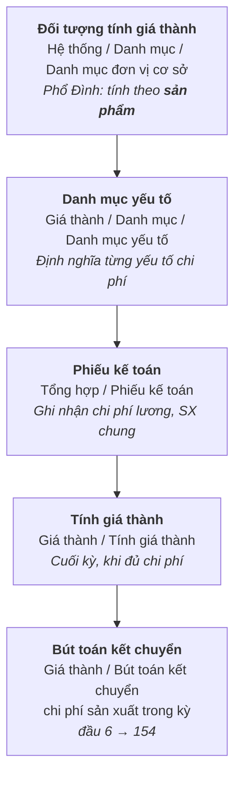

# Giá thành xưởng (KCN Hiệp Phước)

## Nguyên tắc tổ chức

- Mỗi **phòng sản xuất** theo dõi như **một kho độc lập**.
- Khi xuất kho tổng sẽ **quét QR code** để chuyển hàng đến kho của phòng sản xuất tương ứng.
- Các phòng thực hiện **xuất/nhập nguyên liệu và bán thành phẩm** ở mỗi công đoạn.
- **Giá thành không có dở dang cuối kỳ.**

## Luồng chi phí

| Yếu tố chi phí | Cách ghi nhận | Tiêu thức phân bổ |
|---|---|---|
| **621 — NVL chính** | Xuất kho **hàng ngày** theo dữ liệu thực tế phát sinh, chuyển qua Tài chính | Theo **định mức nguyên vật liệu** |
| **621 — NVL dùng chung** | Xuất kho | Phân bổ **cho các thành phẩm mà trong món có sử dụng nguyên liệu này** — *không* phân bổ đều cho tất cả các mã |
| **622 — Chi phí lương** | Hạch toán **theo từng phòng sản xuất**, chuyển qua Tài chính | Theo **chi phí 621** |
| **627 — Chi phí sản xuất chung** | Hạch toán, chuyển qua Tài chính | Theo **chi phí 621** |

!!! important "Điểm khác biệt của NVL dùng chung"
    Nguyên liệu dùng chung **không** phân bổ đều cho tất cả mã thành phẩm, mà chỉ phân bổ cho **những thành phẩm thực sự có sử dụng** nguyên liệu đó theo định mức. Đây là yêu cầu riêng của Phổ Đình.

## Xử lý hai bản Quản trị / Tài chính

**Bản Quản trị:**

- **Áp giá đích danh** cho phần nhập kho thành phẩm.
- Cuối kỳ **tính lại giá thành** của nhà xưởng theo các tiêu thức trên để ra giá thực tế, **nhưng bỏ bước áp giá vào phiếu nhập thành phẩm**.
- Giá tính được mang đi **so sánh, đối chiếu** với giá áp đích danh.

## Xử lý hao hụt vượt định mức

> Cuối tháng, các nguyên liệu xuất kho **vượt mức hao hụt cho phép** sẽ được hạch toán ghi nhận vào **TK 138 chờ xử lý**, đồng thời **giảm chi phí nguyên vật liệu** của giá thành.

## Sau khi nhập BTP

Sau khi nhập bán thành phẩm về **kho tổng**, hàng sẽ được **chuyển đi các chi nhánh theo quy trình xuất kho thương mại**.

## Các bước thực hiện trên hệ thống

| Bước | Đường dẫn | Ghi chú |
|---|---|---|
| **Đối tượng tính giá thành** | Hệ thống / Danh mục / Danh mục đơn vị cơ sở | Khai báo **lần đầu**; mặc định của chương trình là *sản phẩm*. **Phổ Đình chỉ tính giá thành theo sản phẩm** |
| **Danh mục yếu tố** | Giá thành / Danh mục / Danh mục yếu tố | Mỗi chi phí sản xuất được định nghĩa là **một yếu tố** để tập hợp phát sinh trong kỳ |
| **Phiếu kế toán** | Tổng hợp / Phiếu kế toán | Ghi nhận chi phí công lương, chi phí SX chung khi phát sinh. Chương trình **tự gom chi phí** khi tính giá cuối kỳ |
| **Tính giá thành** | Giá thành / Tính giá thành | Kết thúc kỳ kế toán, sau khi đủ chi phí sản xuất |
| **Bút toán kết chuyển** | Giá thành / Bút toán kết chuyển chi phí sản xuất trong kỳ | Chuyển chi phí vào sổ cái, kết chuyển **đầu 6 → đầu 154** |

!!! warning "Điều kiện bắt buộc cho bút toán kết chuyển"
    Người dùng **cần khai báo trường "Tài khoản dở dang" tại danh mục vật tư** để chương trình áp đúng giá trị của tài khoản.
