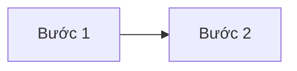

# Cách cập nhật trang web này

Trang web được sinh ra từ các file **Markdown** trong thư mục `docs/`, build bằng **MkDocs Material** và tự động deploy qua **GitHub Actions** mỗi khi bạn push code.

## Cách 1 — Sửa trực tiếp trên GitHub (dễ nhất)

1. Vào repo trên GitHub, mở file `.md` cần sửa trong thư mục `docs/`
2. Bấm biểu tượng **cây bút** (Edit this file)
3. Sửa nội dung → bấm **Commit changes**
4. Đợi ~2 phút, GitHub Actions tự build và cập nhật trang web

Mỗi trang trên site đều có nút **chỉnh sửa** ở góc trên bên phải dẫn thẳng đến file tương ứng.

## Cách 2 — Sửa trên máy rồi push

```bash
git clone https://github.com/<username>/pho-dinh-erp-docs.git
cd pho-dinh-erp-docs

# Sửa file trong docs/ bằng VS Code hoặc bất kỳ editor nào

git add .
git commit -m "Cập nhật nội dung X"
git push
```

## Xem thử trước khi push

```bash
pip install mkdocs-material
mkdocs serve
```

Mở `http://127.0.0.1:8000` để xem trước.

---

## Thêm một trang mới

**Bước 1.** Tạo file `.md` trong thư mục phù hợp, ví dụ `docs/04-mua-hang/trang-moi.md`

**Bước 2.** Thêm vào menu — mở `mkdocs.yml`, tìm mục `nav:` và thêm dòng:

```yaml
nav:
  - Mua hàng:
    - Quy trình mua hàng: 04-mua-hang/quy-trinh.md
    - Trang mới: 04-mua-hang/trang-moi.md   # ← thêm dòng này
```

**Bước 3.** Commit và push.

## Thêm file tài liệu gốc

1. Copy file vào `docs/assets/files/`
2. Thêm dòng link trong `docs/tai-lieu-goc.md`:

```markdown
| Tên file.docx | Mô tả nội dung | [:material-download:](assets/files/ten-file.docx) |
```

!!! warning "Giới hạn dung lượng"
    GitHub giới hạn **100 MB/file**. File video/audio nên lưu ở Google Drive/OneDrive và chỉ dán link vào đây.

---

## Cú pháp Markdown hay dùng

### Bảng

```markdown
| Cột 1 | Cột 2 |
|---|---|
| Giá trị | Giá trị |
```

### Hộp ghi chú

```markdown
!!! note "Tiêu đề"
    Nội dung ghi chú.

!!! warning "Cảnh báo"
    Nội dung cảnh báo.

!!! danger "Nguy hiểm"
    Nội dung quan trọng.
```

### Tab

```markdown
=== "Tab 1"
    Nội dung tab 1

=== "Tab 2"
    Nội dung tab 2
```

### Sơ đồ

````markdown

````

### Link nội bộ

```markdown
[Tên hiển thị](../thu-muc/ten-file.md)
```

---

## Quy ước đặt tên file

- Chữ thường, **không dấu**, dùng dấu gạch ngang: `quy-trinh-mua-hang.md`
- Thư mục có số thứ tự để giữ đúng thứ tự menu: `04-mua-hang/`
- File tài liệu gốc trong `assets/files/` cũng đặt tên **không dấu** để link không bị lỗi
